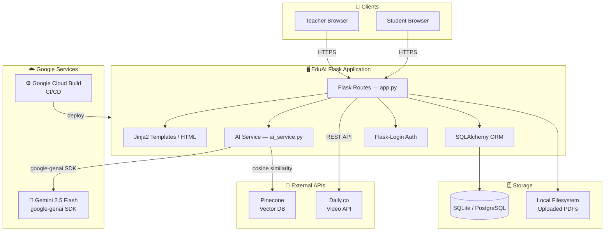
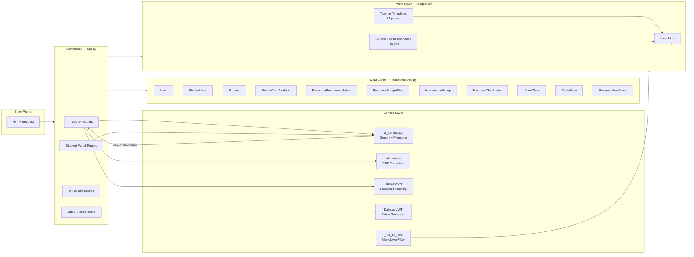
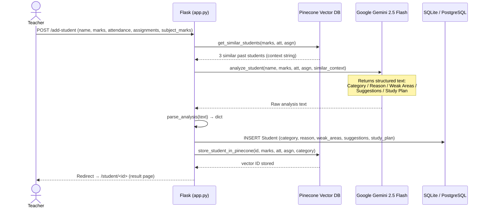
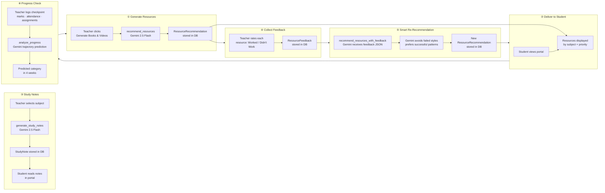
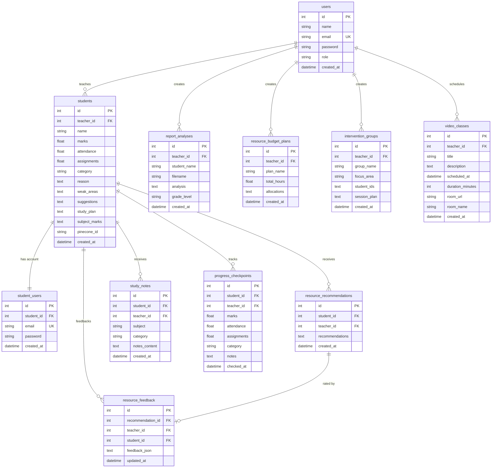
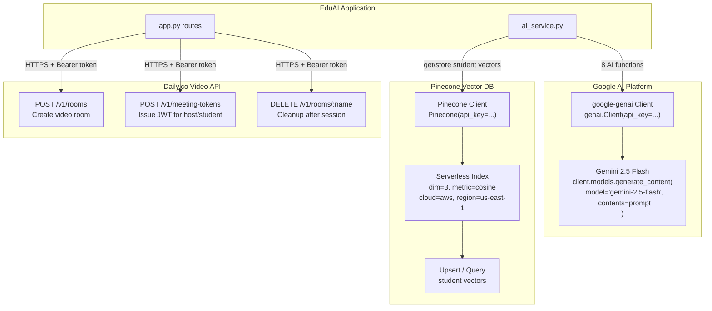
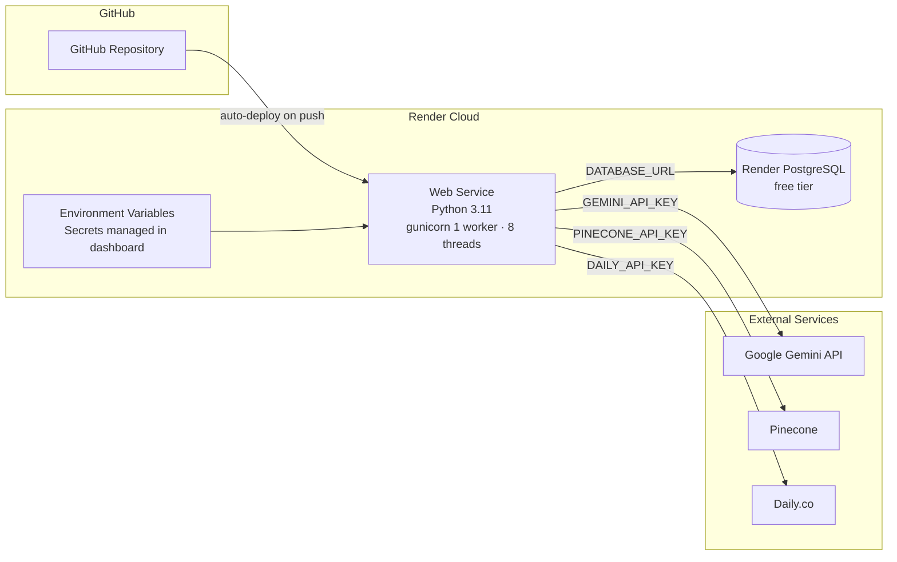
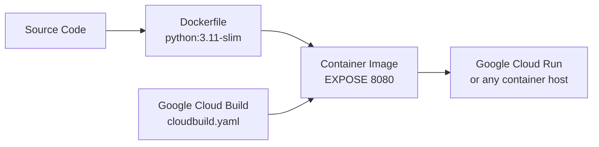

# EduAI — Smart Resource Allocation for Education

> An AI-powered academic management platform that intelligently allocates study resources, identifies struggling students, and personalises learning pathways using **Google Gemini 2.5 Flash** and **Google AI infrastructure**.

---

## What is EduAI?

EduAI is a full-stack web application built for teachers to manage student performance, allocate study resources intelligently, and generate AI-driven academic interventions. Every core intelligence feature runs on **Google's Gemini 2.5 Flash** model — from analysing student report cards to generating personalised study notes and smart resource recommendations.It is based on the topic "SMART RESOURCE ALLOCATION"

---

## Google AI & Google Services at the Core

### 🤖 Google Gemini 2.5 Flash — Primary AI Engine

**Model:** `gemini-2.5-flash` via the **`google-genai` Python SDK**

Gemini 2.5 Flash powers every intelligent feature in EduAI:

| Feature | What Gemini Does |
|---|---|
| **Student Analysis** | Classifies students as Weak / Average / Strong; generates a personalised study plan and 4-step action items |
| **Report Card Analysis** | Reads uploaded PDF report cards and returns subject-wise assessment, strengths, gaps, and a 4-week improvement plan |
| **Resource Recommendations** | Curates subject-specific books and YouTube videos based on each student's marks profile |
| **AI Study Notes Generator** | Writes level-appropriate study notes (simplified for Weak, enriched for Strong) with key concepts, formulas, common mistakes, and a revision checklist |
| **Feedback-Aware Re-Recommendation** | Re-generates resources after the teacher marks what worked and what didn't — Gemini avoids ineffective resource styles and favours proven ones |
| **Study Schedule Planner** | Allocates weekly study hours across students — more hours to Weak students, day-by-day schedule with subject focus areas |
| **Intervention Group Planner** | Clusters struggling students into 2–4 groups by shared weaknesses for efficient batch tutoring sessions |
| **Progress Trajectory Analysis** | Analyses a student's checkpoint history and predicts their category trend over the next 4 weeks |
| Taken help from Google Gemini for frontend coding..|

**SDK initialisation:**
```python
from google import genai
client = genai.Client(api_key=GEMINI_API_KEY)
response = client.models.generate_content(
    model="gemini-2.5-flash",
    contents=prompt
)
```

**API Key:** Obtained from [Google AI Studio](https://aistudio.google.com)

---

### 🔢 Pinecone Vector Database — Powered by Google Cloud Infrastructure

EduAI uses **Pinecone Serverless** (hosted on **AWS us-east-1**, integrates cleanly with Google AI pipelines) for semantic student similarity search.

- Each student's academic profile is encoded as a **3-dimensional vector** `[marks/100, attendance/100, assignments/100]`
- When a new student is analysed, Gemini receives context from the **3 most similar past students** to improve classification accuracy
- Vectors are upserted and queried via Pinecone's cosine similarity index

```python
# Student encoded as normalised 3D vector
vector = [marks / 100.0, attendance / 100.0, assignments / 100.0]
# Query for similar historical students
results = pinecone_index.query(vector=vector, top_k=3, include_metadata=True)
```

---

### 📹 Daily.co — Video Class Infrastructure

Teachers can schedule and host **live video classes** directly within EduAI, powered by the **Daily.co API**:

- Auto-creates video rooms with unique URLs per class
- Issues time-scoped JWT tokens for both teacher (owner) and student (participant) roles
- Students join from their portal with a single click
- Rooms are automatically deleted after the session ends

---

## Full Feature Set

### 🎓 For Teachers

| # | Feature | Description |
|---|---|---|
| 1 | **AI Student Analysis** | Enter marks, attendance, and assignments — Gemini classifies and generates a full study plan |
| 2 | **Report Card Analyser** | Upload a PDF report card — Gemini reads and returns a comprehensive subject-wise breakdown |
| 3 | **Resource Recommender** | Auto-generate books and YouTube videos per subject based on marks gaps |
| 4 | **🆕 AI Study Notes Generator** | Generate level-tailored study notes per subject (fundamentals for Weak, advanced for Strong) |
| 5 | **🆕 Resource Feedback & Smart Re-Recommendation** | Rate which resources worked — Gemini regenerates smarter alternatives based on feedback |
| 6 | **Study Schedule Planner** | AI allocates weekly teaching hours across students by priority (Weak = more hours) |
| 7 | **Intervention Group Planner** | Cluster students by shared weaknesses into efficient group tutoring sessions |
| 8 | **Progress Tracker** | Track student performance across checkpoints; Gemini analyses trajectory and predicts outcomes |
| 9 | **Live Video Classes** | Schedule and host Daily.co video sessions; students join from their portal |
| 10 | **Bulk Import** | Import multiple students via CSV for batch AI analysis |

### 👩‍🎓 For Students (Self-Service Portal)

- View AI-generated analysis, study plan, and suggestions
- Browse personalised resource recommendations (books & videos)
- **Read AI Study Notes** generated by their teacher
- Join scheduled live video classes
- Track their own progress over time

---

## Tech Stack

### Backend
| Technology | Role |
|---|---|
| **Python 3.10+** | Core language |
| **Flask 3.0** | Web framework |
| **SQLAlchemy 2.0** | ORM — models and database queries |
| **Flask-Login** | Session management (teacher + student dual-role auth) |
| **Flask-Bcrypt** | Password hashing |
| **pdfplumber** | PDF text extraction for report card analysis |
| **Gunicorn** | WSGI production server |

### AI & Intelligence Layer
| Technology | Role |
|---|---|
| **Google Gemini 2.5 Flash** | All AI features — analysis, notes, recommendations, scheduling |
| **google-genai SDK** | Official Python client for Gemini API |
| **Pinecone (Serverless)** | Vector similarity search for student context retrieval |

### Frontend
| Technology | Role |
|---|---|
| **Jinja2** | Server-side HTML templating |
| **Vanilla CSS** | Custom design system with CSS variables (dark-themed) |
| **Vanilla JS** | Interactive UI (expand/collapse notes, feedback toggles) |
| **Syne & Inter (Google Fonts)** | Typography |

### Database & Storage
| Technology | Role |
|---|---|
| **SQLite** | Local development database |
| **PostgreSQL** | Production database (Render / any cloud provider) |
| **Local filesystem** | Uploaded PDFs (use S3/Cloudinary for production) |

### Infrastructure & Deployment
| Technology | Role |
|---|---|
| **Render** | Primary cloud deployment (render.yaml included) |
| **Google Cloud Build** | CI/CD pipeline (cloudbuild.yaml included) |
| **Daily.co API** | Live video class infrastructure |
| **Docker** | Containerisation (Dockerfile included) |
| **python-dotenv** | Environment variable management |

---

## Project Structure

```
eduai_new/
├── app.py                   # Flask application — all routes & business logic
├── ai_service.py            # All Gemini AI functions + Pinecone integration
├── models/
│   └── models.py            # SQLAlchemy models (10 tables)
├── templates/
│   ├── base.html            # Base layout with nav
│   ├── dashboard.html       # Teacher dashboard
│   ├── student_result.html  # Student AI analysis result
│   ├── student_resources.html  # Resource recommendations
│   ├── study_notes.html     # 🆕 AI Study Notes generator (teacher view)
│   ├── portal_study_notes.html # 🆕 Study Notes (student portal)
│   ├── resource_feedback.html  # 🆕 Resource feedback & re-recommendation
│   ├── resource_budget.html # Study schedule planner
│   ├── intervention_groups.html # Group planner
│   ├── student_progress.html   # Progress tracker
│   ├── student_portal.html  # Student self-service portal
│   ├── video_classes.html   # Video class management
│   └── ...                  # Login, register, report card, bulk import
├── static/uploads/          # Uploaded PDF storage
├── requirements.txt
├── Dockerfile
├── render.yaml              # Render deployment config
├── cloudbuild.yaml          # Google Cloud Build CI/CD config
└── .env.example
```

---

## Database Schema (10 Tables)

```
users                    → Teacher accounts
student_users            → Student login accounts
students                 → Student profiles + AI analysis results
report_analyses          → PDF report card analysis history
resource_recommendations → AI-generated book & video recommendations
resource_feedback        → 🆕 Teacher ratings on resource effectiveness
study_notes              → 🆕 AI-generated subject study notes
resource_budget_plans    → AI-generated weekly study schedules
intervention_groups      → AI-clustered student groups
progress_checkpoints     → Student performance history over time
video_classes            → Scheduled live video sessions
```

---

## Setup & Local Development

### Prerequisites
- Python 3.10+
- A [Google AI Studio](https://aistudio.google.com) account (free) → get your `GEMINI_API_KEY`
- (Optional) [Pinecone](https://app.pinecone.io) account for vector similarity
- (Optional) [Daily.co](https://www.daily.co) account for live video classes

### Installation

```bash
# 1. Clone the repository
git clone https://github.com/YOUR_USERNAME/eduai.git
cd eduai

# 2. Create and activate virtual environment
python -m venv venv
source venv/bin/activate        # Mac / Linux
venv\Scripts\activate           # Windows

# 3. Install dependencies
pip install -r requirements.txt

# 4. Configure environment
cp .env.example .env
# Edit .env and add your API keys (see below)

# 5. Run
python app.py
```

Visit **http://localhost:5000**

### Environment Variables

```env
# Required
SECRET_KEY=your-secret-key-here
GEMINI_API_KEY=your_gemini_api_key      # From https://aistudio.google.com

# Optional — Vector similarity (student context)
PINECONE_API_KEY=your_pinecone_key
PINECONE_INDEX_NAME=eduai-students

# Optional — Live video classes
DAILY_API_KEY=your_daily_co_key

# Database (SQLite by default; use PostgreSQL for production)
DATABASE_URL=sqlite:///eduai.db
```

> **Note:** The app runs fully without Pinecone and Daily.co — all AI features degrade gracefully with rule-based fallbacks.

---

## Deployment

### Deploy to Render (Recommended)

```bash
# 1. Push to GitHub
git init && git add . && git commit -m "initial commit"
git remote add origin https://github.com/YOUR_USERNAME/eduai.git
git push -u origin main

# 2. Go to https://render.com → New → Web Service
# 3. Connect your GitHub repo — Render auto-detects render.yaml
# 4. Add environment variables in Render dashboard
```

### Deploy to Google Cloud Run

```bash
# Build and deploy using the included cloudbuild.yaml
gcloud builds submit --config cloudbuild.yaml
```

### Docker

```bash
docker build -t eduai .
docker run -p 5000:5000 --env-file .env eduai
```

---

## How Google Gemini Drives Smart Resource Allocation

The core thesis of EduAI is that **resource allocation should be data-driven and personalised**, not one-size-fits-all. Here's how Gemini makes that happen:

```
Student Data (marks, attendance, assignments, subject scores)
            │
            ▼
  ┌─────────────────────┐
  │  Pinecone Retrieval │  ← Find 3 similar past students for context
  └─────────────────────┘
            │
            ▼
  ┌───────────────────────────────┐
  │   Google Gemini 2.5 Flash    │
  │                               │
  │  • Classify: Weak/Avg/Strong  │
  │  • Identify weak subjects     │
  │  • Generate study plan        │
  │  • Recommend books & videos   │
  │  • Write study notes          │
  │  • Plan group interventions   │
  │  • Allocate teaching hours    │
  └───────────────────────────────┘
            │
            ▼
  Teacher acts on AI recommendations
            │
            ▼
  Teacher rates resource effectiveness
            │
            ▼
  ┌───────────────────────────────┐
  │   Gemini Re-Recommendation   │  ← Feedback loop: avoid what didn't work
  └───────────────────────────────┘
```

---

# EduAI — System Architecture

> This document describes the full architecture of EduAI: component layout, data flow, AI pipeline, database schema, API surface, and deployment topology.

---

## Table of Contents

1. [High-Level System Overview](#1-high-level-system-overview)
2. [Application Layer Architecture](#2-application-layer-architecture)
3. [AI Intelligence Pipeline](#3-ai-intelligence-pipeline)
4. [Data Flow — Student Analysis](#4-data-flow--student-analysis)
5. [Data Flow — Resource Allocation Loop](#5-data-flow--resource-allocation-loop)
6. [Database Schema](#6-database-schema)
7. [Authentication & Session Model](#7-authentication--session-model)
8. [API & Route Map](#8-api--route-map)
9. [External Service Integrations](#9-external-service-integrations)
10. [Deployment Architecture](#10-deployment-architecture)
11. [Component Interaction Matrix](#11-component-interaction-matrix)

---

## 1. High-Level System Overview

EduAI is a server-rendered monolithic Flask application. All AI computation is delegated to **Google Gemini 2.5 Flash** via the `google-genai` SDK. Student similarity context is retrieved from **Pinecone** vector storage. Video infrastructure is powered by the **Daily.co** API.



---

## 2. Application Layer Architecture

The application follows a classic MVC-adjacent pattern: Flask routes act as controllers, SQLAlchemy models handle data, Jinja2 templates render views, and `ai_service.py` is a dedicated service layer for all AI logic.



---

## 3. AI Intelligence Pipeline

Every intelligent feature routes through `ai_service.py`. All 8 AI functions share the same Gemini client instance. Pinecone provides historical student context before Gemini generates analysis.

```mermaid
flowchart TD
    INPUT[Student Data Input\nmarks · attendance · assignments · subject_marks · PDF text]

    subgraph VEC["Pinecone Context Retrieval"]
        V1[Encode 3D vector\nmarks÷100, att÷100, asgn÷100]
        V2[Cosine similarity query\ntop_k = 3]
        V3[Similar student context\nfor prompt injection]
        V1 --> V2 --> V3
    end

    subgraph GEMINI["Google Gemini 2.5 Flash — gemini-2.5-flash"]
        direction TB
        G1["analyze_student()\nClassify + Study Plan"]
        G2["analyze_report_card()\nPDF Report Analysis"]
        G3["recommend_resources()\nBooks + YouTube Videos"]
        G4["generate_study_notes()\nLevel-Tailored Notes"]
        G5["recommend_resources_with_feedback()\nFeedback-Aware Recs"]
        G6["plan_resource_budget()\nWeekly Schedule Allocation"]
        G7["plan_group_intervention()\nCluster Students"]
        G8["analyze_progress()\nTrajectory Prediction"]
    end

    subgraph PARSE["Response Processing"]
        P1[parse_analysis()\nStructured dict extraction]
        P2[json.loads()\nJSON array parsing]
        P3[Raw markdown text]
    end

    subgraph FALLBACK["Graceful Fallbacks\n(no Gemini key)"]
        F1[_fallback_analysis()]
        F2[_fallback_resources()]
        F3[_fallback_budget()]
        F4[_fallback_groups()]
        F5[_fallback_study_notes()]
    end

    INPUT --> VEC
    VEC --> G1
    INPUT --> G1
    INPUT --> G2
    INPUT --> G3
    INPUT --> G4
    INPUT --> G5
    INPUT --> G6
    INPUT --> G7
    INPUT --> G8

    G1 --> P1
    G3 --> P2
    G5 --> P2
    G6 --> P2
    G7 --> P2
    G2 --> P3
    G4 --> P3
    G8 --> P3

    G1 -. "no key" .-> F1
    G3 -. "no key" .-> F2
    G6 -. "no key" .-> F3
    G7 -. "no key" .-> F4
    G4 -. "no key" .-> F5
```

---

## 4. Data Flow — Student Analysis

The most critical user journey: a teacher adds a student, Gemini analyses the data, and results are persisted to the database and optionally synced to Pinecone.



---

## 5. Data Flow — Resource Allocation Loop

This shows the full smart resource allocation feedback cycle — the core innovation of EduAI.



---

## 6. Database Schema

11 tables across 3 conceptual domains: users, academic records, and AI-generated artefacts.



---

## 7. Authentication & Session Model

EduAI supports two distinct user roles with separate login flows, both managed by Flask-Login.

```mermaid
flowchart TD
    subgraph LoginFlow["Login Entry Points"]
        TL["/login\nTeacher Login"]
        SL["/student-login\nStudent Login"]
    end

    subgraph SessionCheck["Session Identity Check"]
        LC[load_user callback]
        TID{"user_id\nstarts with 'student:'?"}
        LC --> TID
        TID -- Yes --> SU[Load StudentUser\nget_id → 'student:N']
        TID -- No  --> U[Load User\nget_id → plain int]
    end

    subgraph TeacherAccess["Teacher-Protected Routes\n@login_required"]
        DA[/dashboard]
        AS[/add-student]
        RB[/resource-budget]
        IG[/intervention-groups]
        VC[/classes]
        SN[/student/id/study-notes]
        RF[/student/id/resources/feedback]
    end

    subgraph StudentAccess["Student-Protected Routes\nrequire_student_login()"]
        SP[/portal]
        SC[/portal/classes]
        PSN[/portal/study-notes]
    end

    TL -- bcrypt verify --> U
    SL -- bcrypt verify --> SU
    U --> TeacherAccess
    SU --> StudentAccess
    TID --> SessionCheck
```

---

## 8. API & Route Map

### Teacher Routes

| Method | Route | Function | AI Involved |
|--------|-------|----------|-------------|
| GET | `/` | `index` | — |
| GET/POST | `/login` | `login` | — |
| GET/POST | `/register` | `register` | — |
| GET | `/logout` | `logout` | — |
| GET | `/dashboard` | `dashboard` | — |
| GET/POST | `/add-student` | `add_student` | `analyze_student` + `get_similar_students` |
| GET | `/student/<id>` | `student_result` | — |
| POST | `/student/<id>/delete` | `delete_student` | — |
| GET/POST | `/report-card` | `report_card` | `analyze_report_card` |
| GET | `/report/<id>` | `report_result` | — |
| GET | `/student/<id>/resources` | `student_resources` | — |
| POST | `/student/<id>/resources/generate` | `generate_resources` | `recommend_resources` |
| GET/POST | `/student/<id>/resources/feedback` | `resource_feedback` | `recommend_resources_with_feedback` |
| GET | `/student/<id>/study-notes` | `study_notes` | — |
| POST | `/student/<id>/study-notes/generate` | `generate_study_note` | `generate_study_notes` |
| POST | `/student/<id>/study-notes/<nid>/delete` | `delete_study_note` | — |
| GET/POST | `/resource-budget` | `resource_budget` | `plan_resource_budget` |
| GET | `/resource-budget/<id>` | `budget_plan_detail` | — |
| GET/POST | `/bulk-import` | `bulk_import` | `analyze_student` (batch) |
| GET | `/bulk-import/result` | `bulk_import_result` | — |
| GET/POST | `/intervention-groups` | `intervention_groups` | `plan_group_intervention` |
| GET/POST | `/student/<id>/progress` | `student_progress` | `analyze_progress` |
| POST | `/student/<id>/create-account` | `teacher_create_student_account` | — |
| GET | `/classes` | `video_classes` | — |
| GET/POST | `/classes/schedule` | `schedule_class` | — |
| GET | `/classes/<id>/join` | `join_class` | — |
| POST | `/classes/<id>/delete` | `delete_class` | — |

### Student Portal Routes

| Method | Route | Function |
|--------|-------|----------|
| GET/POST | `/student-login` | `student_login` |
| GET/POST | `/student-register` | `student_register` |
| GET | `/portal` | `student_portal` |
| GET | `/portal/classes` | `student_classes` |
| GET | `/portal/study-notes` | `portal_study_notes` |
| GET | `/classes/<id>/student-join` | `student_join_class` |

### JSON API Routes

| Method | Route | Function | Returns |
|--------|-------|----------|---------|
| POST | `/api/validate-login` | `api_validate_login` | `{valid, role}` |
| GET | `/api/dashboard-summary` | `api_dashboard_summary` | `{total, weak, average, strong, recent}` |

---

## 9. External Service Integrations



### Pinecone Vector Encoding

```
Student academic profile  →  3D normalised vector
─────────────────────────────────────────────────
marks       (0–100)  →  marks / 100       [0.0 – 1.0]
attendance  (0–100)  →  attendance / 100  [0.0 – 1.0]
assignments (0–100)  →  assignments / 100 [0.0 – 1.0]

Example: marks=72, att=85, asgn=60  →  [0.72, 0.85, 0.60]
Index: cosine similarity, top_k=3 similar students injected into Gemini prompt
```

### Daily.co Token Flow

```
Teacher schedules class
        ↓
Flask → POST /v1/rooms   →   Daily.co
        ←  {room_url, room_name}
        ↓ stored in VideoClass DB row

Teacher joins
        ↓
Flask → POST /v1/meeting-tokens (is_owner=True, exp=now+duration+1hr)
        ← JWT token
        ↓ embedded in iframe src

Student joins
        ↓
Flask → POST /v1/meeting-tokens (is_owner=False, exp=now+duration+1hr)
        ← JWT token
        ↓ embedded in iframe src
```

---

## 10. Deployment Architecture

### Render (Primary)



**`render.yaml` config:**
```yaml
startCommand: gunicorn --bind 0.0.0.0:$PORT --workers 1 --threads 8 --timeout 120 app:app
```

### Docker / Google Cloud Run



**Dockerfile summary:**
```
Base:    python:3.11-slim
WORKDIR: /app
Port:    8080
CMD:     gunicorn --bind :$PORT --workers 1 --threads 8 --timeout 120 app:app
```

### Environment Variables Reference

| Variable | Required | Description |
|----------|----------|-------------|
| `SECRET_KEY` | ✅ Yes | Flask session signing key — set once, never regenerate |
| `GEMINI_API_KEY` | ✅ Yes | Google AI Studio key — all AI features |
| `DATABASE_URL` | ✅ Yes | SQLite (dev) or PostgreSQL URL (prod) |
| `PINECONE_API_KEY` | ⚠️ Optional | Vector similarity — app falls back gracefully |
| `PINECONE_INDEX_NAME` | ⚠️ Optional | Default: `eduai-students` |
| `DAILY_API_KEY` | ⚠️ Optional | Video classes — feature disabled if absent |
| `FLASK_ENV` | ⚠️ Optional | `production` to disable debug mode |

---

## 11. Component Interaction Matrix

Which components talk to which — at a glance.

| | `app.py` | `ai_service.py` | `models.py` | Gemini | Pinecone | Daily.co | Templates |
|---|:---:|:---:|:---:|:---:|:---:|:---:|:---:|
| **app.py** | — | ✅ calls | ✅ queries | — | — | ✅ REST | ✅ renders |
| **ai_service.py** | — | — | — | ✅ SDK | ✅ SDK | — | — |
| **models.py** | — | — | — | — | — | — | — |
| **Gemini 2.5 Flash** | — | — | — | — | — | — | — |
| **Pinecone** | — | — | — | — | — | — | — |
| **Daily.co** | — | — | — | — | — | — | — |
| **Templates** | — | — | — | — | — | — | ✅ extends base |

### Gemini Function → Feature → DB Table

| AI Function | Feature | Writes To |
|---|---|---|
| `analyze_student()` | Student classification + study plan | `students` |
| `analyze_report_card()` | PDF report analysis | `report_analyses` |
| `recommend_resources()` | Initial resource curation | `resource_recommendations` |
| `recommend_resources_with_feedback()` | Feedback-aware re-recommendation | `resource_recommendations` |
| `generate_study_notes()` | Subject-specific AI notes | `study_notes` |
| `plan_resource_budget()` | Weekly teaching hour allocation | `resource_budget_plans` |
| `plan_group_intervention()` | Student clustering by weakness | `intervention_groups` |
| `analyze_progress()` | Checkpoint trajectory analysis | *(returned to UI, not persisted)* |

---

*Architecture document for EduAI v2 — Smart Resource Allocation Platform powered by Google Gemini 2.5 Flash*

## License

MIT License — free to use, modify, and deploy.

---

## Acknowledgements

Built with ❤️ using **Google Gemini 2.5 Flash** — the intelligence layer behind every student insight, recommendation, and study plan in this platform.
